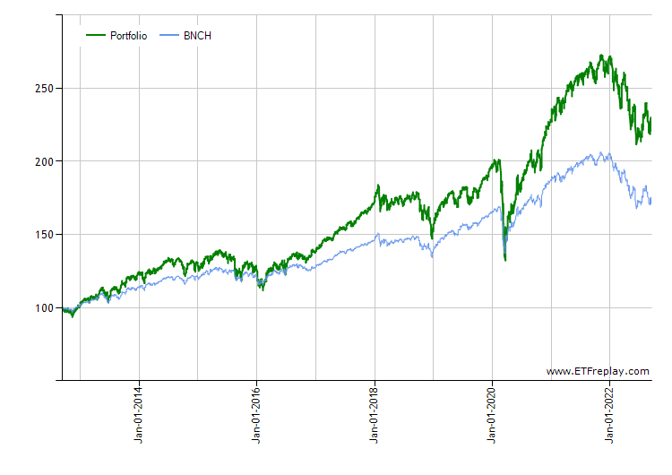
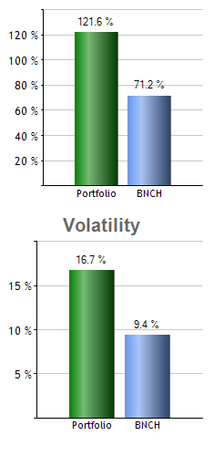
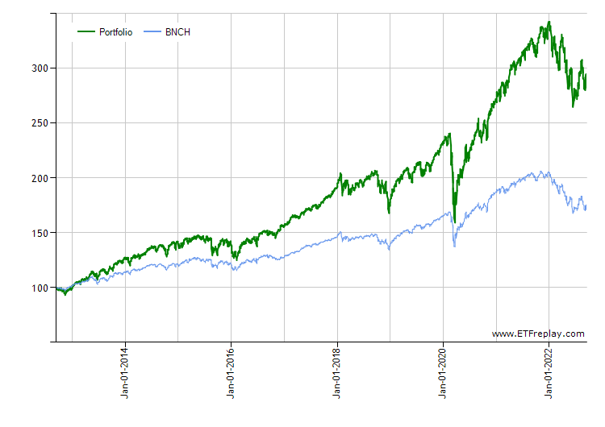
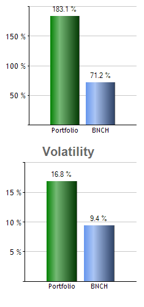
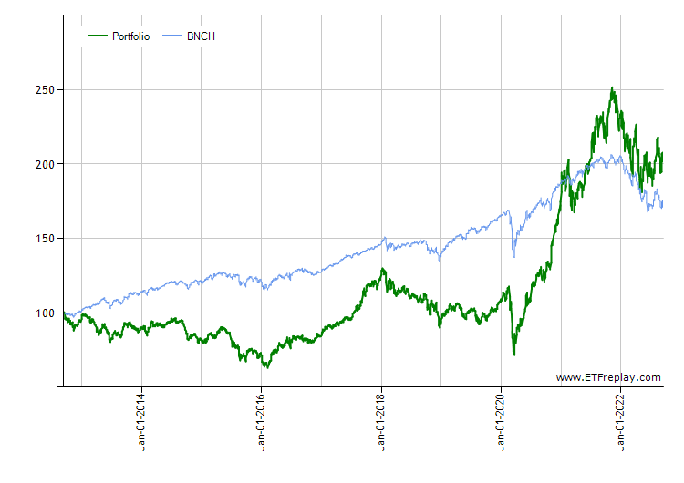
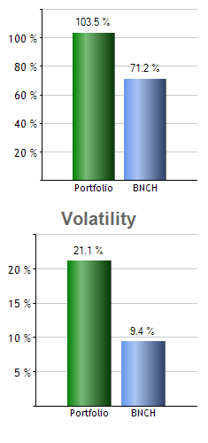

# Passive ETF Investment Strategy

The intent of this strategy is to be applicable to general public who want to invest without worrying about the status of investments.

This document outlines ideas for consideration. Please ensure to read the [Important Notice](#important-notice) at the bottom of this document.

**NOTE:** This document does not explore fixed-income ETFs as the strategies described in this document are optimised for wealth creation not income generation.

## Purpose

This section is a reference guide as a supplement to the subsequent sections with more detail.

The aim is to invest in broad market Exchange Traded Funds (ETFs) that have a low expense ratio and represent a diversified basket portfolio of equities.

### Common Terminology

The process of passive investing in ETFs can be referred to as [Dollar Cost Averaging (DCA)](https://www.investopedia.com/terms/d/dollarcostaveraging.asp) and a small proportion (e.g. 10% - 15%) of every pay should be automatically deposited in a brokerage and the relevant amount of ETFs purchased.

All strategies have several similar ETFs. The important consideration is Assets Under Management (AUM) and Expense Ratio.

-   Higher AUM generally means a more successful fund that has more capital to deploy when working with large-cap assets. Higher AUM ETFs are generally more expensive per share as they command a higher market share.
-   Higher Expense ratio means less return to the investor of that ETF.

From the set of similar ETFs, every investor should consider the highest AUM and lowest Expense Ratio ETF that matches their investment objectives.

When macroeconomic factors affect the broad market, terminology such as "risk on" (investors taking on more risk by buying risky assets) or "risk off" (investors shedding risk by selling risky assets) is important to understand when engaging in more complex strategies.

## Passive: Total Market Strategy

### Investment Objective

Purchase shares of one or two total market ETFs.

### Thesis

Human industry, hard work, growing population, improved technology, orderly central bank, and favourable government policies contribute to secular improvements in global or regional economies.

### Portfolio

-   100% invested in a single ETF chosen from the [list below](#etfs)

For example, with a $500 monthly deposit, purchase 10x shares of SPGM for $471, remainder is left for next month.

This portfolio time horizon is between 12 to 24 months between rebalancing between ETFs.

## Semi-passive: US and Global Market Strategy

### Investment Objective

Purchase a proportion of a US market ETF and a Global market ETF. Typically a 60-40 split is used, such that:

-   Risk on: 60% US and 40% Global
-   Risk off: 40% US and 60% Global

### Thesis

The United States is unique with a mostly unrestrained free-market capitalist approach to markets. As the World Reserve Currency (WRC) holder, the US Federal Reserve and the US Government are able to export a lot of inflation to the rest of the world while preserving the stability of their own markets. Given its WRC status, equities denoted in the US dollar are able to return higher growth on invested capital than other parts of the world.

During periods of Quantitative Easing (QE) combined with access to the cheapest credit on the planet, the US markets experience periods of outsized growth that are unmatched by the rest of the world. The high growth is a result of volatility, which has a complementary higher risk profile. Equally, this means that high growth and high decline are equally possible in the US markets.

In order to capture wealth creation opportunities, this strategy approach is to construct a portfolio that has limited exposure to US markets and Global markets.

### Portfolio

During periods of growth, such as QE, a 'risk on' porfolio means that more capital is allocated to higher risk markets in search of higher returns. Vice versa for periods of balance.

When the US or Global markets experiences periods of balance and turbulence, a rebalance is required to move the portfolio from 'risk on' to 'risk off' state. This is achieved by selling a proportion of US market ETFs (cash extraction) and, with the proceeds, purchasing a global market ETF.

This portfolio time horizon is between 3 months to 12 months between rebalancing between ETFs.

| Risk on                             | Risk off                            |
| :---------------------------------- | :---------------------------------- |
| US market ETF: 60% of porfolio      | US market ETF: 40% of porfolio      |
| Global market ETF: 40% of portfolio | Global market ETF: 60% of portfolio |

For example, with a $500 monthly deposit, purchase:

| Risk on                     | Risk off                    |
| :-------------------------- | :-------------------------- |
| 1x share of SPY for $393.13 | 1x share of QQQ for $293.52 |
| 1x share of VT for $87.32   | 2x share of VT for $174.64  |
| Leave $19.55 for next month | Leave $31.84 for next month |

## Sector-weighted: Ethical, ESG, or Asset class-specific Strategy

### Investment Objective

Purchase shares in three ETFs that represent a diversified balance between total market and a sector or asset class of interest.

This could be done such that:

-   30% of portfolio in Global market ETF
-   30% and 40% of portfolio in Sector or Regional ETFs

### Thesis

Building on the diversified base of a Global market ETF, an assumption is made that some sectors will outperform in the next investment period (5+ years).

Major societal changes as the Boomer generation retires & Millenials become the largest population cohort, climate change begins to affect food production and living conditions, technological progress with 'green technology', commercialized space-based industry grows, there are ETFs that track supply chains and sectors that have a high level of governmental policy tail-winds, outsized funding by large asset managers (e.g. BlackRock), provide ample opportunities to generate wealth.

### Portfolio

Whether the global economy is going through periods of growth or balance, this portfolio structure has a long term view that is largerly unaffected by typical market turbulence.

A typical portfolio will allocate:

-   30% in a Global market ETF
-   30% and 40% in a Sector or Regional ETF

For example, with a $500 monthly deposit, purchase:

-   1x VT for $87.32
-   3x LIT for $229.71
-   1x REMX for $99.69
-   Leave $83.28 for next month

This portfolio time horizon is between 12 months to 36 months between rebalancing between ETFs.

## ETFs

All data as at 15-09-2022. Ordered by Region then AUM.

There are thousands of ETFs. The ones listed in these tables are a subset for purposes of demonstration.

### US-listed ETFs

| Region or Sector     | Symbol | ETF Name                                    | Currency |       AUM | Expense Ratio | NAV price |
| -------------------- | :----- | :------------------------------------------ | :------: | --------: | :-----------: | --------: |
| Global               | VT     | Vanguard Total World Stock ETF              |   USD    |  $23,040M |     0.07%     |    $87.32 |
| Global               | ACWI   | iShares MSCI ACWI ETF                       |   USD    |  $16,947M |     0.33%     |    $85.65 |
| Global               | URTH   | iShares MSCI World ETF                      |   USD    |   $2,123M |     0.24%     |   $109.97 |
| Global               | SPGM   | SPDR Portfolio MSCI Global Stock Market ETF |   USD    |     $493M |     0.09%     |    $47.16 |
| US                   | SPY    | SPDR S&P 500 ETF Trust                      |   USD    | $373,180M |     0.09%     |   $393.13 |
| US                   | VOO    | Vanguard 500 Index Fund                     |   USD    | $361,360M |     0.03%     |   $361.36 |
| US                   | IVV    | iShares Core S&P 500 ETF                    |   USD    | $306,300M |     0.03%     |   $395.18 |
| US                   | QQQ    | Invesco QQQ Trust                           |   USD    | $174,320M |     0.20%     |   $293.52 |
| US                   | IWM    | iShares Russell 2000 ETF                    |   USD    |  $53,560M |     0.19%     |   $182.96 |
| US                   | VGT    | Vanguard Information Technology ETF         |   USD    |  $44,203M |     0.10%     |   $342.89 |
| US                   | DIA    | SPDR Dow Jones Industrial Average ETF Trust |   USD    |  $28,460M |     0.19%     |   $311.71 |
| Battery Supply Chain | LIT    | Global X Lithium & Battery Tech ETF         |   USD    |   $4,640M |     0.75%     |    $76.57 |
| Semiconductor        | SOXX   | iShares Semiconductor ETF                   |   USD    |     $495M |     0.40%     |   $358.00 |
| Rare-Earth Metals    | REMX   | VanEck Rare Earth/Strategic Metals ETF      |   USD    |     $882M |     0.53%     |    $99.69 |

### ASX-listed ETFs

| Region or Sector | Symbol | ETF Name                                   | Currency |      AUM | Expense Ratio | NAV price |
| ---------------- | :----- | :----------------------------------------- | :------: | -------: | :-----------: | --------: |
| ANZ              | VAS    | Vanguard Australian Shares Index ETF       |   AUD    | $27,650M |     0.10%     |    $86.48 |
| ANZ              | A200   | Betashares Australia 200 ETF               |   AUD    |  $2,506M |     0.07%     |   $115.58 |
| ANZ Tech         | VDHG   | Vanguard Diversified High Growth Index ETF |   AUD    |  $1,760M |     0.27%     |    $54.04 |
| ANZ Tech         | ATEC   | ETFS Morningstar Global Technology ETF     |   AUD    |    $156M |     0.48%     |    $16.72 |
| ANZ US S&P 500   | QUS    | BETASHARES S&P 500 Equal Weight ETF        |   AUD    |    $193M |     0.40%     |    $40.56 |

## Past Performance Backtesting

**NOTE:** Past performance is not indicative of future results.

Using backtesting provided by [ETF Replay](https://www.etfreplay.com/combine.aspx) for a 10 year period between Sep 14, 2012 - Sep 14, 2022, the following results are provided for the three strategies:

For comparison, an total all-world market ([BNCH](https://www.etfreplay.com/etf/bnch.aspx)) is provided as a baseline, which is a synthetic portfolio comprising of 60% all-world equities and 40% all-world bonds, representing one of the most diversified portfolios possible.

### Passive: Total Market Strategy

### Semi-passive: US market and Global market Strategy

### Sector-weighted: Ethical, ESG, or Asset class-specific Strategy

## Important Notice

> This document should not be taken as constituting professional advice from the author or otherwise. The author is not a financial adviser.
>
> You should consider seeking independent legal, financial, taxation or other advice to check how this information relates to your unique circumstances.
>
> The author is not liable for any loss caused, whether due to negligence or otherwise arising from the use of, or reliance on, the information provided directly or indirectly, by use of this document.
